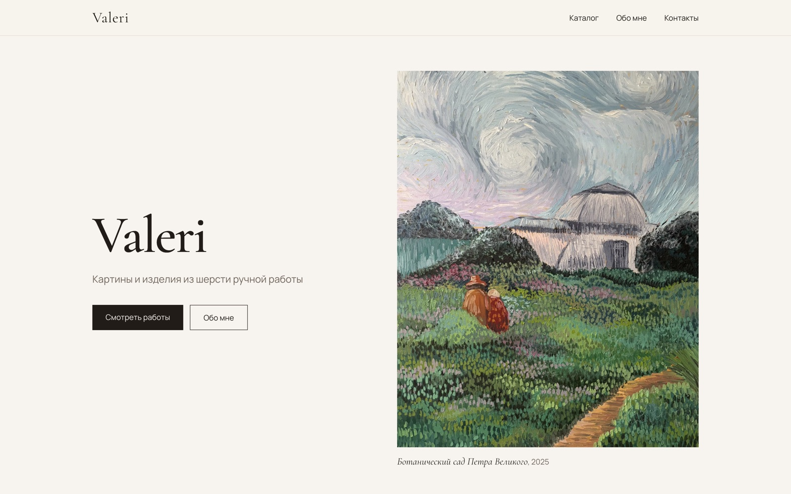
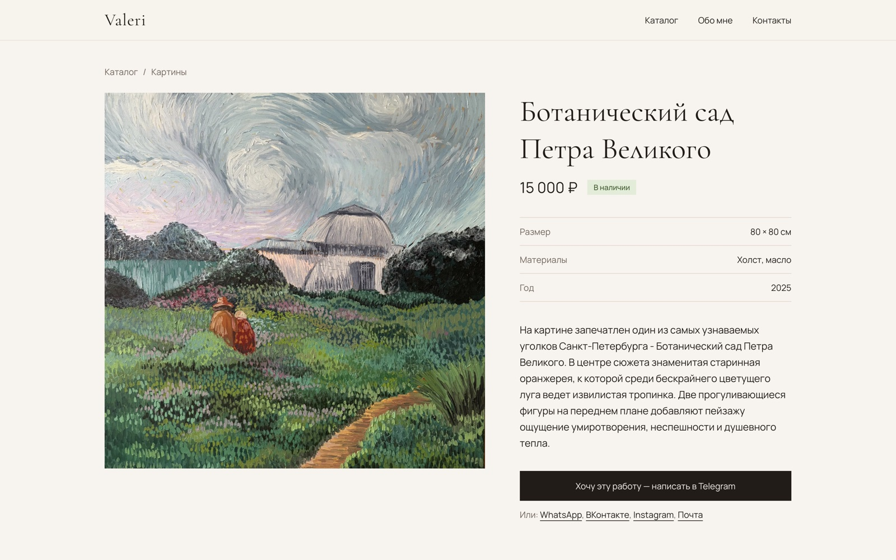
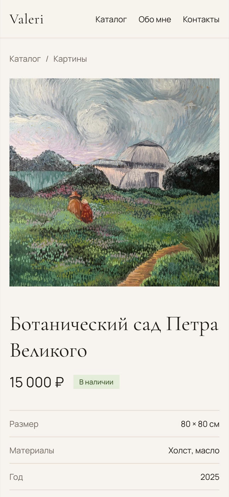

# Valeri — Artist Portfolio & Catalog

**[Live site → valericherni.vercel.app](https://valericherni.vercel.app)**

A showcase site for an artist's paintings and handmade wool pieces. The artist manages the catalog herself through an embedded Sanity Studio. Visitors buy through a "I want this piece" button that opens Telegram or WhatsApp with a prefilled message.

Built with Next.js 16 (App Router), Sanity 6, Tailwind CSS 4 and TypeScript. It's a real production site.



<table>
  <tr>
    <td width="68%"></td>
    <td width="32%"></td>
  </tr>
</table>

## What's inside

- **Static pages with on-demand revalidation.** Every page is prerendered. A signed Sanity webhook hits `/api/revalidate`, which verifies the signature and calls `revalidateTag`, so a published edit shows up on the site within seconds.
- **Embedded CMS.** Sanity Studio lives at `/studio` inside the same Next.js app. It has a Russian UI, a custom desk structure and a singleton "Site settings" document, so a non-technical editor can't create duplicates or delete it.
- **Image pipeline on the Sanity CDN.** A custom `next/image` loader requests resized WebP/AVIF from Sanity. The crop and focal point (hotspot) the editor picks in Studio are applied in previews, and LQIP blur placeholders come straight from asset metadata.
- **Catalog filters synced to the URL.** Category and "available only" filters live in search params, so filtered views are shareable. They run client-side over a statically generated page and fall back to plain links without JS.
- **Messenger checkout.** No cart or payments: contact links build Telegram/WhatsApp deep links with the artwork title and URL already in the message.
- **SEO.** Generated `sitemap.xml` and `robots.txt`, per-artwork Open Graph images from the cover photo. The site URL comes from Vercel's production domain when it isn't set explicitly.
- **Works without a CMS.** If no Sanity project ID is configured, the site runs on local mock data, so it can be cloned and started right away.

## Running it locally

```bash
npm install
npm run dev
```

Open http://localhost:3000. Without `NEXT_PUBLIC_SANITY_PROJECT_ID` the site uses mock data from [src/lib/mock.ts](src/lib/mock.ts).

## Connecting Sanity

1. Create a project at [sanity.io/manage](https://www.sanity.io/manage) with a `production` dataset.
2. Copy `.env.example` to `.env.local` and fill in the project ID.
3. In **API → CORS origins**, add `http://localhost:3000` with **Allow credentials** enabled, otherwise Studio can't sign in.
4. Open `/studio` and fill in **Site settings** (name, tagline, About, contacts), then categories and artworks. The buy button only appears once at least one contact is set.

## Deploying to Vercel

1. Import the repository into Vercel and set the variables from `.env.example`. `NEXT_PUBLIC_SITE_URL` is optional; it defaults to the project's production domain.
2. Open `/studio` on the deployed site and click **Register Studio** (this adds the CORS origin).
3. In Sanity **API → Webhooks**, create a webhook:
   - URL: `https://<domain>/api/revalidate`
   - Trigger on: Create, Update, Delete
   - Filter: `_type in ["artwork", "category", "siteSettings"]`
   - Projection: `{_type}`
   - Secret: the same value as `SANITY_REVALIDATE_SECRET`

Without the webhook, changes still appear within an hour.

## Project structure

| Path | Contents |
| --- | --- |
| `src/app/(site)/` | Site pages: home, `/catalog`, `/catalog/[slug]`, `/about` |
| `src/app/studio/` | Embedded Sanity Studio |
| `src/app/api/revalidate/` | Sanity webhook receiver, invalidates the cache |
| `src/sanity/schemaTypes/` | Content schemas: artwork, category, site settings |
| `src/sanity/queries.ts` | GROQ queries |
| `src/lib/data.ts` | Data access: Sanity or mock data |
| `sanity.config.ts` | Studio config: locale, desk structure, singleton actions |
